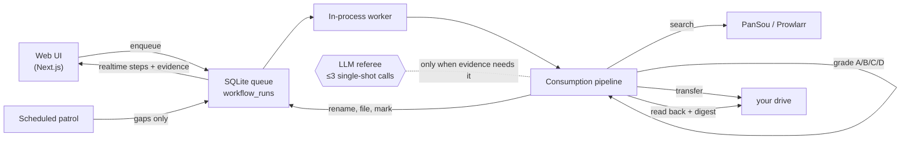

<p align="center">
  
</p>

<p align="center">
  <b>An agent-driven media library for your cloud drives.</b>
</p>

<p align="center">
  <a href="https://github.com/CodeByZack/mediary-scout/actions/workflows/ci.yml"></a>
  <a href="https://github.com/CodeByZack/mediary-scout/releases"></a>
  <a href="LICENSE"></a>
</p>

<p align="center">
  <a href="https://github.com/CodeByZack/mediary-scout/releases/latest">📥 Download</a> ·
  <a href="README.zh-CN.md">中文文档</a>
</p>

---

You ask for a movie, show, or anime; Mediary Scout searches resource indexes (PanSou / Prowlarr), transfers the best match into your own 115 / Quark / GuangYaPan / 123 / Tianyi drive, verifies what actually landed, names it canonically, and keeps tracking what's still missing. Deterministic code owns every step; an LLM is only consulted as a single-shot referee at genuine judgement points — a clean acquisition typically costs two AI calls, often zero.


## Install

### 飞牛 fnOS native app (recommended on NAS)

Grab the `.fpk` for your architecture from [Releases](https://github.com/CodeByZack/mediary-scout/releases/latest) (`mediary-scout-arm.fpk` / `mediary-scout-x86.fpk`) and install it from the fnOS App Center (manual install). The app runs on port **3333** with its data directory persisted by fnOS — no Docker, no terminal. Packaging internals: **[deploy/fpk/README.md](deploy/fpk/README.md)**.

### Docker Compose (any always-on host)

```bash
git clone https://github.com/CodeByZack/mediary-scout && cd mediary-scout
cp .env.example .env   # optional — most config can be set in the UI
docker compose --project-directory . -f deploy/docker/docker-compose.yml up -d   # web + a bundled PanSou + SQLite volume
```

Then open `http://<host>:3000` and configure in **Settings**. Full walkthrough: **[docs/deploy.md](docs/deploy.md)**.

> 🇨🇳 **Can't reach Docker Hub (mainland China)?** See **[docs/deploy.md → registry mirror](docs/deploy.md#国内构建加速docker-hub-常年不稳定)**.

| | fnOS fpk | Docker |
|---|---|---|
| **Best for** | 飞牛 NAS, zero-terminal install | NAS / router / spare PC / VPS |
| **Data layer** | SQLite under the app's data dir | SQLite (`mediary-data` volume) |
| **Port** | 3333 | 3000 |
| **Always-on patrol** | ✅ | ✅ |
| **Multi-user** | ✅ | ✅ |
| **Remote access** | Tailscale | Tailscale |

All product logic is identical — one codebase, one SQLite engine.

## Features

| | |
|---|---|
| **Search → acquire** — find a title, hit 获取, the pipeline takes over |  |
| **Library wall** — what you have, per drive, with missing / airing badges |  |
| **Show detail** — season coverage, gaps, tracking state |  |
| **Realtime activity** — a live queue + per-step evidence you can expand |  |
| **Notifications** — per-acquisition + daily digest, multi-channel push |  |
| **Settings** — drives, quality, language, LLM (BYO-key), Prowlarr, PanSou |  |

Multiple drives appear as a workspace switcher with per-brand icons:


## What it is

Most "media automation" either searches well but doesn't know what you're actually missing, or moves files but never verifies what landed. Mediary Scout treats acquisition as a **state problem**, driven by evidence, not vibes:

- **Multi-drive, brand-extensible** — five drives today (Quark, 115, 光鸭 GuangYaPan, 123, 天翼 Tianyi), each a first-class workspace (a tree model: one account, many drives). Adding a new drive brand is a contained plugin.
- **Deterministic-first acquisition** — candidates are A/B/C/D-graded by mechanical rules (title/alias matching incl. traditional↔simplified folding, season & episode patterns, Chinese-subtitle markers, dead-link memory). A unique grade-A candidate is transferred blind; the LLM is only asked when evidence genuinely needs judgement (selection, diagnosis, episode-mapping), always as a bounded single call.
- **Verify, then mark** — every transfer is re-read from the drive and digested (covered? dirty package? wrong season?) before anything is renamed, filed into `Title.SxxExx` shape, and marked obtained. Failure is reported honestly as no-coverage — it never fakes success.
- **Tracking & scheduled gap-fill** — season-level state machine; a scheduled patrol comes back only for shows that still have missing episodes.
- **Cloud-native** — it **transfers** shares/magnets straight into your drive (秒传 / save), it does not download to a local disk.

## Supported drives

Five Chinese cloud drives, each a first-class workspace — ordered by how many PanSou resources each can consume (115 and 123 are dual-path: own share links **and** magnets):

- **Quark / 夸克** (`quark`) — share-link transfer (no magnet web API). The largest share pool on PanSou by far.
- **123网盘** (`pan123`) — **dual-path like 115**: share-link transfer (`123pan.com/s/…`) **and** magnets via its native offline-download API. QR login (~90-day token) or paste a token. Free accounts can transfer. **[Setup guide](docs/deploy.md#123网盘连接)**
- **115** (`pan115`) — full support: 115 share links **and** magnets (built-in offline path, plus Prowlarr).
- **GuangYaPan / 光鸭云盘** (`guangya`) — Xunlei-family drive; **magnet / offline-download only** in v1. Token auth. Pairs well with Prowlarr. **[Setup guide](docs/deploy.md#光鸭云盘guangyapan连接)**
- **Tianyi / 天翼云盘** (`tianyi`) — share-link transfer (`cloud.189.cn/t/…`); QR login or paste an SSON cookie. Smallest share pool on PanSou today. **[Setup guide](docs/deploy.md#天翼云盘连接)**

Measured share volume per drive (2026-07 point-in-time sample: six popular titles across movie / drama / anime, one PanSou instance with curated channels — your channels will vary):

| Drive | Own share links | Magnets it can also eat | Usable pool |
| --- | ---: | ---: | ---: |
| Quark | 523 | — | **523** |
| 123 | 120 | 361 | **481** |
| 115 | 100 | 361 | **461** |
| 光鸭 | — | 361 | **361** |
| 天翼 | 63 | — | **63** |

New brands plug into a storage-brand registry; the bulk of adding one is a drive client + a storage executor for that drive's transfer API.

## How one run flows



- State lives in **SQLite** (`MEDIA_TRACK_SQLITE_PATH`) — runs are resumable across restarts; the pipeline rebuilds from real drive + DB state, not cached chat history.
- Metadata comes from **TMDB** (works out of the box; bring your own key in Settings to use your own quota).
- Every step is persisted to `agent_steps` — the activity page shows expandable per-step evidence and grading digests.

## Agent API (agent-first control)

The web app exposes a local HTTP API that lets any coding agent (Claude Code, Codex, opencode, …) operate Mediary Scout without opening the GUI — change settings, trigger acquisitions, check progress. Set `MEDIA_TRACK_AGENT_TOKEN` to enable it.

| Method | Path | Purpose |
|---|---|---|
| `GET` | `/api/agent/config` | Read settings (secrets masked) |
| `PUT` | `/api/agent/config` | Partial update (rejects masked `***` writes) |
| `POST` | `/api/agent/acquire` | Search TMDB → queue (409 on ambiguity) |
| `POST` | `/api/agent/patrol` | Trigger a patrol sweep |
| `GET` | `/api/agent/library` | Tracked titles + missing episodes |
| `GET` | `/api/agent/activity` | Active queue + recent notifications |

All require `Authorization: Bearer <token>`. No token configured → `404` (invisible). Wrong/missing token → `401`.

## Deploy with an agent

Prefer to have an AI agent walk you through deployment? Paste this prompt:

````markdown
You are deploying Mediary Scout, a self-hosted media-acquisition app. Follow the repo's docs/deploy.md. Ask the user the questions below IN ORDER, then execute.

## MUST ask (don't start without answers)
1. **Where are you deploying?** 飞牛 fnOS NAS (native .fpk — see deploy/fpk/README.md), or any Docker host (NAS / router / spare PC / VPS)? How do I operate the machine — SSH, or its local terminal?
2. **Single-user or multi-user?** Default single-user (just you). Multi-user lets family/friends each register, bind their own drives, and keep separate libraries.

## SHOULD ask (have defaults, but confirm preference)
3. **Local-only, or reach it from outside?** LAN only (default) or Tailscale (recommended for home; never expose the port raw).
4. **Configure real acquisition now, or just get it running first?** Real acquisition needs a supported drive (Quark/115/光鸭/123/天翼) + an LLM endpoint (OpenAI-compatible).

## Then execute (Docker path)
- `git clone https://github.com/CodeByZack/mediary-scout && cd mediary-scout`
- Mainland China: set `DOCKER_MIRROR` in `.env` (see docs/deploy.md) before the first `up`
- `docker compose --project-directory . -f deploy/docker/docker-compose.yml up -d` (first build takes a few minutes)
- Multi-user: add `MEDIA_TRACK_MULTI_USER=1` to `.env`, then `docker compose --project-directory . -f deploy/docker/docker-compose.yml up -d web`
- Open `http://<host>:3000`, walk the user through Settings (drive / LLM / optional extras)
- Verify it's up, report the URL, and tell them how to upgrade (`git pull && ./scripts/deploy.sh`)
```

> **Disclaimer.** Mediary Scout is **open-source, self-hosted software**. It is **not** offered, and never will be offered, as a hosted service — you run your own instance and bring your own drive / LLM / metadata credentials. It performs the same kinds of file operations you could do by hand in your own cloud drive. See [docs/distribution-and-legal-positioning.md](docs/distribution-and-legal-positioning.md) for the project's stance.

## Status & limitations

- Self-hosted, for advanced users; you need usable access to a supported drive (a membership is most practical on 115/夸克; 123/天翼 work on free accounts).
- Scheduled monitoring is most valuable on an always-on host.
- Chinese-subtitle fetching depends on the drive's capabilities (115 and 光鸭 support subtitle transfer; Quark / 天翼 / 123 do not).
- This is not a hosted product and ships no hosted backend.

## Credits

Built on top of, and grateful to:

- [PanSou](https://github.com/fish2018/pansou-web) — resource search backend
- [Prowlarr](https://github.com/Prowlarr/Prowlarr) — indexer manager (optional)
- [p115client](https://github.com/ChenyangGao/p115client) — 115 API reference
- [AList](https://github.com/AlistGo/alist) — GuangYaPan (光鸭云盘) API integration reference (the `drivers/guangyapan` driver)
- [p123client](https://github.com/ChenyangGao/p123client) — 123网盘 API reference
- [cloud189-auto-save](https://github.com/1307super/cloud189-auto-save) / [cloudpan189-api](https://github.com/tickstep/cloudpan189-api) — 天翼云盘 API references
- [TMDB](https://www.themoviedb.org/) — metadata (this product is not endorsed or certified by TMDB)

Not affiliated with 115, Quark, 光鸭云盘 (GuangYaPan), 123网盘, 天翼云盘, TMDB, or any indexer. Mediary Scout is an independent, disciplined workflow built around these pieces.
