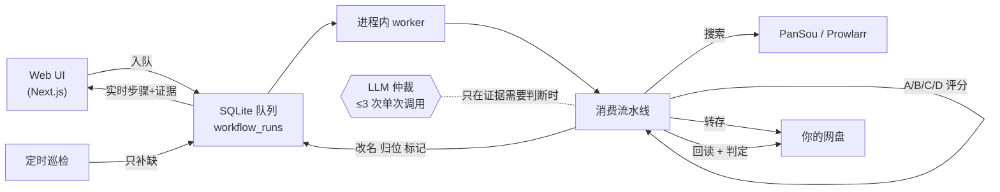

<p align="center">
  
</p>

<p align="center">
  <b>给你自己网盘用的媒体获取与追踪引擎。</b>
</p>

<p align="center">
  <a href="https://github.com/CodeByZack/mediary-scout/actions/workflows/ci.yml"></a>
  <a href="https://github.com/CodeByZack/mediary-scout/releases"></a>
  <a href="LICENSE"></a>
  
  
  
  
</p>

<p align="center">
  <a href="#快速开始">快速开始</a> ·
  <a href="docs/deploy.md">部署指南</a> ·
  <a href="https://github.com/CodeByZack/mediary-scout/releases/latest">📥 下载</a> ·
  <a href="README.md">English</a>
</p>

---

你说要某部电影 / 剧 / 番,Mediary Scout 跨资源索引源(PanSou / Prowlarr)搜索,把最合适的**转存进你自己的 115 / 夸克 / 光鸭 / 123 / 天翼 网盘**,转存后回读验证、按 TMDB 规范命名归位,并持续追踪还缺什么集。确定性代码拥有每一步的执行与校验,LLM 只在真正需要判断的节点做**有界的单次仲裁**——一次干净的获取通常只花 2 次 AI 调用,顺利时更少。


> **免责声明。** Mediary Scout 是**开源、自部署**软件,**不提供、也永远不会提供托管服务** —— 你自己跑实例、自带网盘 / LLM / 元数据凭证。它做的就是你本可以在自己网盘里手动完成的那些文件操作。项目定位详见 [docs/distribution-and-legal-positioning.md](docs/distribution-and-legal-positioning.md)。

## 目录

- [它是什么](#它是什么)
- [功能](#功能)
- [快速开始](#快速开始)
- [支持的网盘](#支持的网盘)
- [一次任务怎么跑](#一次任务怎么跑)
- [Agent API](#agent-api让-ai-agent-替你操作)
- [部署](#部署)
- [状态与限制](#状态与限制)
- [致谢](#致谢)

## 它是什么

大多数「媒体自动化」要么搜得好但不知道你到底缺哪集,要么会搬文件却从不验证落了什么。Mediary Scout 把获取当成一个**状态问题**,凭证据行动:

- **多盘、品牌可扩展** —— 现支持夸克、115、光鸭(GuangYaPan)、123、天翼五块盘,每块盘都是一等工作区(树模型:一个账号、多块盘)。接入新品牌是个收敛的插件活。
- **确定性优先的获取** —— 候选资源先过机械评分(A/B/C/D:标题/别名匹配含简繁折叠、季与集数规则、中字标记、死链记忆与同名异作排除)。唯一 A 级候选直接盲转;LLM 只在选片、诊断、集数映射三个升级点被**单次**咨询,解析失败保守降级。
- **先验证,再入库** —— 每次转存都回读网盘真实落盘结果做判定(覆盖了吗?脏包吗?超季吗?),通过才规范改名(`Title.SxxExx`)、归位、标记已获取;失败如实报告无覆盖,绝不伪造成功。
- **追踪 + 定时补缺** —— 季级状态机;定时巡检只回来处理仍有缺集的剧,一季失败不阻塞其它季。
- **网盘原生** —— 直接把分享 / 磁力**转存**(秒传 / save)进你的网盘,不往本地磁盘下载。

面向熟悉自己网盘账号与凭证的进阶自部署用户 —— 不是一键式消费产品。

## 功能

| | |
|---|---|
| **搜索 → 获取** —— 找到目标、点「获取」,流水线接管 |  |
| **媒体库墙** —— 按盘看你有什么,带缺集 / 追更徽章 |  |
| **剧详情** —— 各季覆盖、缺口、追踪状态 |  |
| **实时活动** —— 实时队列 + 可展开的每步证据与评分摘要 |  |
| **通知** —— 单部获取 + 每日巡检摘要,多渠道推送 |  |
| **设置** —— 网盘、画质、语言、LLM(自带 key)、Prowlarr、PanSou |  |

多块盘以工作区切换器呈现,带各自品牌图标:


## 快速开始

### 飞牛 fnOS 原生应用(NAS 首选)

去 [Releases](https://github.com/CodeByZack/mediary-scout/releases/latest) 下载对应架构的 `.fpk`(`mediary-scout-arm.fpk` / `mediary-scout-x86.fpk`),在 fnOS 应用中心「手动安装」即可。应用跑在 **3333** 端口,数据由 fnOS 应用目录持久化 —— 不装 Docker、不开终端。打包细节:**[deploy/fpk/README.md](deploy/fpk/README.md)**。

### Docker Compose(任何常开主机)

```bash
git clone https://github.com/CodeByZack/mediary-scout && cd mediary-scout
cp .env.example .env   # 可选——大多数配置可在 UI 里填
docker compose --project-directory . -f deploy/docker/docker-compose.yml up -d   # web + 自带 PanSou + SQLite 卷
```

> 🇨🇳 **国内 Docker Hub 不稳定?** 首次构建报 `auth.docker.io ... i/o timeout` = 需要镜像加速,在 `.env` 加 `DOCKER_MIRROR=docker.1ms.run` 再 `up`。详见 **[docs/deploy.md → 国内构建加速](docs/deploy.md#国内构建加速docker-hub-常年不稳定)**。

打开 web UI,在**设置**里按需提供(全部自带):

- **网盘** —— 115 / 夸克 / 天翼 / 123 扫码登录(或粘 cookie/token),光鸭粘贴 token(见[连接教程](docs/deploy.md#光鸭云盘guangyapan连接))。凭证入库后自动用于转存。
- **TMDB** —— 开箱即用;想用自己的额度可在设置填 key。
- **LLM** —— 任意 OpenAI 兼容端点(`baseURL` / `apiKey` / `modelId`)。你的 key 只留在你自己的实例。
- **Prowlarr**(可选) —— 加你的索引器以获得磁力 / 种子源(115、光鸭等支持磁力的盘;夸克无磁力 API)。

## 支持的网盘

五个国内网盘品牌,每块盘都是一等工作区(按可消费 PanSou 资源量排序;115 与 123 是双路径:自有分享链 + 磁力):

- **夸克**(`quark`) —— 分享链转存(无磁力 web API)。PanSou 上分享池最大。
- **123网盘**(`pan123`) —— 分享链 + 原生离线下载双路径;扫码登录(约 90 天有效)或粘 token;**免费账号可转存**。
- **115**(`pan115`) —— 完整支持,含经 Prowlarr 的磁力;支持字幕文件一并转存。
- **光鸭云盘 / GuangYaPan**(`guangya`) —— 迅雷系网盘;**v1 仅磁力 / 离线下载**(不转分享链),与 Prowlarr 搭配最好;支持字幕转存。**[连接教程 →](docs/deploy.md#光鸭云盘guangyapan连接)**
- **天翼云盘**(`tianyi`) —— 分享链转存;扫码或粘 SSON cookie;PanSou 上分享池目前最小。**[连接教程 →](docs/deploy.md#天翼云盘连接)**

分享量抽样(2026-07 时点样本:6 部热门片 × 一个配好频道的 PanSou 实例,你的频道配置会不同):

| 盘 | 自有分享链 | 可兼收磁力 | 可用池 |
| --- | ---: | ---: | ---: |
| 夸克 | 523 | — | **523** |
| 123 | 120 | 361 | **481** |
| 115 | 100 | 361 | **461** |
| 光鸭 | — | 361 | **361** |
| 天翼 | 63 | — | **63** |

新品牌接入 storage-brand 注册表;大头是为该网盘的转存 API 写一个客户端 + 一个 storage executor。

## 一次任务怎么跑



- 状态全程落 **SQLite**(`MEDIA_TRACK_SQLITE_PATH`),run 可在重启后续跑(从真实网盘 + DB 状态重建,不依赖缓存的对话历史)。
- 每一步写入 `agent_steps` 表 —— 活动页可展开每步证据、评分摘要与预算消耗。
- 元数据来自 **TMDB**;资源搜索来自 **PanSou**,可选 **Prowlarr**(磁力 / 种子索引器)。

## Agent API:让 AI agent 替你操作

应用暴露一套本地 HTTP API,Claude Code / Codex / opencode 等任何 coding agent 不开 GUI 也能操作:改设置、触发获取、查进度。设置环境变量 `MEDIA_TRACK_AGENT_TOKEN` 即启用。

| 方法 | 路径 | 用途 |
|---|---|---|
| `GET` | `/api/agent/config` | 读设置(敏感值打码) |
| `PUT` | `/api/agent/config` | 部分更新(拒绝写回打码值) |
| `POST` | `/api/agent/acquire` | 搜 TMDB → 入队(歧义时 409) |
| `POST` | `/api/agent/patrol` | 触发一轮巡检 |
| `GET` | `/api/agent/library` | 追踪中的条目 + 缺集 |
| `GET` | `/api/agent/activity` | 活动队列 + 最近通知 |

全部要求 `Authorization: Bearer <token>`。未配置 token → `404`(不可见);token 错 / 缺 → `401`。

## 部署

自部署到飞牛 NAS(fpk)、群晖 / 软路由 / 闲置 PC 或 VPS(docker compose),并经 **Tailscale** 从手机 / 电视访问(无需公网 IP;别把端口裸暴露)。完整教程:**[docs/deploy.md](docs/deploy.md)**。

### 让 agent 帮你部署

想让 AI agent 带你走?把下面这段丢给它——它会问对问题、然后替你部署:

````markdown
你要部署 Mediary Scout,一个自部署的媒体获取应用。按仓库 docs/deploy.md 来。按顺序问用户,然后执行。

## 必问(没答案别开始)
1. **部署到哪?** 飞牛 fnOS NAS(原生 .fpk,看 deploy/fpk/README.md),还是任何能跑 Docker 的机器(NAS / 软路由 / 闲置 PC / VPS)?我怎么操作它——SSH,还是本机终端?
2. **单账号还是多账号?** 默认单账号。多账号让家人/朋友各注册、各绑自己的网盘、各看各的库。

## 建议问(有默认,但确认偏好)
3. **只在局域网用,还是出门也要?** 局域网(默认)或 Tailscale(家用推荐,别裸暴露端口)。
4. **现在就配真实获取,还是先起来看看?** 真实获取需要支持的网盘 + LLM 端点(OpenAI 兼容)。

## 然后执行(Docker 路径)
- `git clone https://github.com/CodeByZack/mediary-scout && cd mediary-scout`
- 国内:首次 `up` 前在 `.env` 设 `DOCKER_MIRROR`(见 docs/deploy.md)
- `docker compose --project-directory . -f deploy/docker/docker-compose.yml up -d`(首次构建几分钟)
- 多账号:`.env` 加 `MEDIA_TRACK_MULTI_USER=1`,再 `docker compose --project-directory . -f deploy/docker/docker-compose.yml up -d web`
- 打开 `http://<主机>:3000`,带用户走设置页(网盘 / LLM / 可选项)
- 确认起来、报 URL、告诉怎么升级(`git pull && ./scripts/deploy.sh`)
```

## 状态与限制

- 自部署、面向进阶用户;需要可用的 115 / 夸克 / 123 / 天翼 / 光鸭(115、夸克有会员最实用;123 / 天翼免费账号可转存)。
- 定时巡检在常开的主机上价值最大。
- 中文字幕获取受网盘能力限制(115、光鸭支持字幕一并转存;夸克 / 天翼 / 123 暂不支持)。
- 这不是托管产品,不附带任何托管后端。

## 致谢

构建于以下项目之上,并致谢:

- [PanSou](https://github.com/fish2018/pansou-web) —— 资源搜索后端
- [Prowlarr](https://github.com/Prowlarr/Prowlarr) —— 索引器管理(可选)
- [p115client](https://github.com/ChenyangGao/p115client) —— 115 API 参考
- [AList](https://github.com/AlistGo/alist) —— 光鸭云盘 API 集成参考(`drivers/guangyapan` driver)
- [p123client](https://github.com/ChenyangGao/p123client) —— 123网盘 API 参考
- [cloud189-auto-save](https://github.com/1307super/cloud189-auto-save) / [cloudpan189-api](https://github.com/tickstep/cloudpan189-api) —— 天翼云盘 API 参考
- [TMDB](https://www.themoviedb.org/) —— 元数据(本产品未获 TMDB 认证或背书)

与 115、夸克、光鸭云盘、123网盘、天翼云盘、TMDB 及任何索引器均无隶属关系。Mediary Scout 是围绕这些组件构建的、克制的独立工作流。
